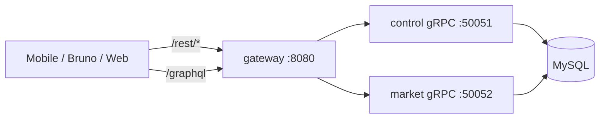

# Engineering & Architecture

This document explains how SpiceLedger Backend is structured, why certain layers exist, and what we deliberately chose **not** to build.

## Design goals

1. **One public HTTP edge** — clients talk to a single port (`8080`) with predictable routes.
2. **gRPC between services** — domain logic stays in `control` and `market`; HTTP is a thin translation layer.
3. **Consistent envelopes** — REST and GraphQL HTTP responses use `{ success, message, data }`.
4. **Graceful lifecycle** — SIGTERM triggers orderly HTTP and gRPC shutdown (no dropped in-flight work during deploys).
5. **Boring ops** — Docker Compose for local/full stack; goose migrations; structured logging.

## System topology



### Route map (gateway)

| Path | Handler | Upstream |
|------|---------|----------|
| `/rest/*` | REST BFF | `control` gRPC |
| `/graphql` | GraphQL | `control` + `market` gRPC |
| `/playground` | gqlgen UI | — |
| `/health` | Liveness | — |
| `/ready` | Readiness stub | — |

REST paths are mounted with `StripPrefix("/rest")`, so internal REST routes remain `/accounts/login`, `/health`, etc. Clients use `http://host:8080/rest/accounts/login`.

## ADR: Unified gateway (replaces proxy + split HTTP services)

**Status:** Accepted

**Context:** We previously ran three HTTP containers — `rest` (:8082), `graphql` (:8081), and `proxy` (:8080). The proxy only forwarded traffic and added latency. Mobile already used `BASE_URL/rest/...` through the proxy while GraphQL sometimes bypassed it on `:8081`.

**Decision:** Merge HTTP into one `gateway` process that in-process mounts REST and GraphQL handlers. Drop the standalone `proxy` container from Docker Compose.

**Consequences:**

- One fewer network hop in production.
- One health check surface for HTTP.
- `rest` and `graphql` packages remain as libraries; `gateway/cmd/gateway` is the only HTTP entrypoint.

## ADR: Keep REST alongside GraphQL (for now)

**Status:** Accepted (transitional)

**Context:** Mobile auth and merchant flows use REST today. Admin catalog uses GraphQL. Duplication exists for products/grades/daily-prices.

**Decision:** Do **not** remove REST yet. GraphQL is the strategic API for rich admin/market operations; REST stays for stable mobile auth contracts until the app migrates.

**Not overkill:** REST is not redundant *yet* — it serves different clients and shapes. What *was* overkill was a **separate reverse-proxy container** forwarding to two other HTTP containers.

**Future:** Point mobile `GRAPHQL_CLIENT` to `http://host:8080/graphql`, migrate auth to GraphQL mutations, then deprecate REST catalog routes.

## ADR: gRPC for internal services

**Status:** Accepted

`control` owns accounts, sessions, catalog metadata. `market` owns transactions and market metrics. HTTP gateways translate to protobuf RPCs — no shared SQL across services at the edge.

Each gRPC server registers the standard [gRPC health protocol](https://github.com/grpc/grpc/blob/master/doc/health-checking.md) via `internal/platform.RegisterHealth`.

## Shared platform package

`internal/platform` centralizes production concerns:

| Module | Responsibility |
|--------|----------------|
| `RunHTTP` | Timeouts, signal handling, `Shutdown` |
| `RunGRPC` | `GracefulStop` with 30s fallback to `Stop` |
| `RegisterHealth` | gRPC health service |

Domain packages (`control`, `market`) focus on business logic; mains delegate lifecycle to platform.

## Response contract

All REST handlers should use `util.WriteJSONResponse`, `util.WriteBadRequest`, `util.WriteMethodNotAllowed`, or `util.WriteGRPCErrorResponse` — never raw `http.Error`, which breaks the envelope.

GraphQL HTTP responses are wrapped in `graphql/response_envelope.go` to match the same shape.

## Local development

```bash
# Full stack (recommended)
make up-full-build

# Or run processes individually against local MySQL
make run-control    # :50051
make run-market     # :50052
make run-gateway    # :8080 (REST + GraphQL)
```

## Production checklist

- [ ] Set strong `JWT_SECRET`, `DB_PASSWORD`, `BASIC_AUTH_PASS` (`APP_ENV=production` enforces this).
- [ ] Put TLS termination in front of gateway (nginx, cloud LB, or service mesh).
- [ ] Wire `/ready` to check gRPC upstream health before accepting traffic.
- [ ] Add integration tests for gateway routes and gRPC interceptors.

## What great backends avoid

- **Extra hops without value** — the old three-container HTTP chain is gone.
- **Inconsistent error shapes** — clients should never parse HTML or plain-text errors.
- **Silent shutdown** — always drain connections on SIGTERM.
- **God packages** — `gateway` wires; `control`/`market` own domain; `util` owns cross-cutting helpers.
